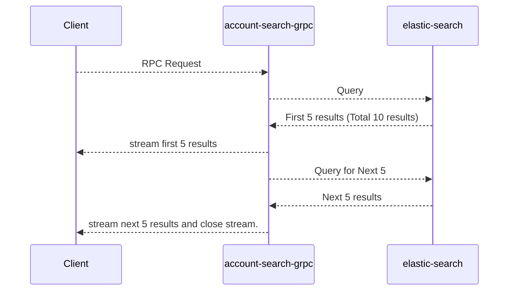
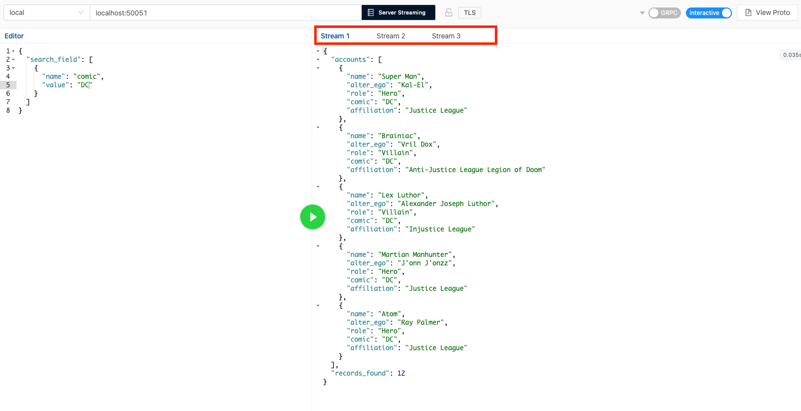

# gRPC Microservice with Java

gRPC developed by Google is gaining a lot of traction these days since it can use protocol buffers for data serialization. This makes the 
payloads smaller, faster and simple. Various tests shows gRPC to be much faster(more than 10x) than REST based applications.

gRPC: 

- It is built on Protocol Buffer(Protobuf)
- Multiplex many requests with one connection through HTTP/2
- In built code generation for numerous languages
- Smaller payload
- Header compression
- Faster message transmission
- Binary protocol

A plain gRPC service could be slower in terms of implementation perspective since we are used to quick development of 
APIs with frameworks such as Springboot etc. However, with [grpc-spring-boot-starter](https://github.com/LogNet/grpc-spring-boot-starter)
I think we can quickly get around the problems in terms of slower implementation, service discovery, load balancing etc.

AWS recently started supporting HTTP2 with GRPC in their application load balancing. We could also use App Mesh in tandem with
Elastic Container Service to deploy, discover and implement a microservices mesh.

With gRPC, your client will use a stub that is generated from the proto to invoke the ALB with gRPC service as a backend. 
ALB will allow clients to talk to a mix of both gRPC and non-gRPC services target groups.

Read More at [grpc.io](https://grpc.io/)

## account-search

Project is a sample service developed with plain gRPC implementation. The service talks to a elastic search server to 
filter the data based on the input payload.

To demonstrate server side streaming, we stream results from the elastic search 5 at a time. Hence, we are using search-after
functionality in the elastic search query.

Example: If there are 20 results based on the query, we query only for the first 5 from elastic search, then stream the 
results to client, then query again for the next 5 and stream it. This is repeated until we reach the last result.

This approach is good when you have thousands of results that needs to be sent to client. Streaming a partial set each 
time will make sure that we keep our resource utilization at bay.



The service is defined in the search.proto file.

### search.proto

```protobuf
syntax = "proto3";

package account;

import "account/account-search.proto";

option java_multiple_files = true;
option java_package = "com.bbb.grpc.account.service";

service AccountSearchService {
  rpc accountSearch(SearchRequest) returns (stream SearchResponse) {};
}


```

We are using gradle plugin to automatically generate the service definition code. 

Payload is defined in account-search.proto and account.proto files

### account.proto
```protobuf
syntax = "proto3";

package account;

option java_multiple_files = true;
option java_package = "com.bbb.grpc.account.beans";

message Account {
  string name = 1;
  string alter_ego = 2;
  string role = 3;
  string comic = 4;
  string affiliation = 5;
}
```

### account-search.proto

```protobuf

syntax = "proto3";

package account;

import "account/account.proto";

option java_multiple_files = true;
option java_package = "com.bbb.grpc.account.beans";

message SearchRequest {
  repeated SearchKey search_field = 1;
}

message SearchKey {
  string name = 1;
  string value = 2;
}


message SearchResponse {
  repeated Account accounts = 1;
  int32 records_found = 2;
}
```
``AccountServer.java`` is the entry point that needs to be run to start the gRPC server.

## How to Run


I have packaged everything as containers for the ease of running.

1) Create the java classes from the proto files
   
   ```
   shell ./gradlew generateProto 
   
   ```
   
   [ You can find the code under build/genrated/source/proto folder ]


2) Compile 

   ```shell
    ./gradlew clean build
   ```

3) Create Uber/Fat jar

   ```shell
   ./gradlew shadowJar
   ```

4) Create a docker network

   ```shell
   docker network create -d bridge account-bridge-nw
   ```

5) Export env variables

   ```shell
    export ELASTIC_HOSTS=http://elastic:9200
   ```
6) Run elastic search container

   ```
   docker run -itd -p 9200:9200 --network=account-bridge-nw --name=elastic  vnair5/elastic-search
   ```
    I have preloaded the container elastic search with index and data.
    
7) Run the gRPC service
    ```
    docker run -itd -p 50051:50051 --env ELASTIC_HOSTS --network=account-bridge-nw vnair5/account-search-service:latest
    ```

Now you can make requests to the service to test the same. 

## Ways to test:

- Generate stub from the proto files and make requests to the service

- Use tools like BloomRPC to test. [BloomRPC](https://github.com/uw-labs/bloomrpc)


## Screenshot



Since the total number of records found is 12, there are 3 streams. 
The first 2 stream has 5 records each, and the final stream has 3 records.
